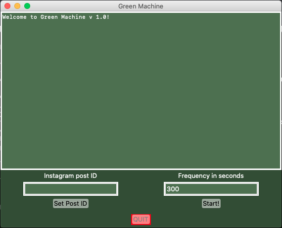
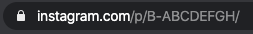

# GreenMachine
Monitoring tool for your Instagram videos. 

## What it does
This tool sends a requests to monitor the number of views on your Instagram video. The only thing thing that user need to input is the video id and the time frequency of the requests. Note, if you do it too quickly Instagram API may think that you are a bot, so do not abuse your endpoint. 
Once the values are set user can start the background process that sends the request to given post and it returns nuber of likes and views.

## How to get the post ID?
To get the post ID open the post in your browser and copy the text that is after `http://instagram.com/p/` without the last slash. Here is an example:

In this example `B-ABCDEFGH` is the Post ID
